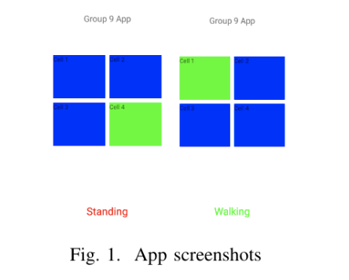
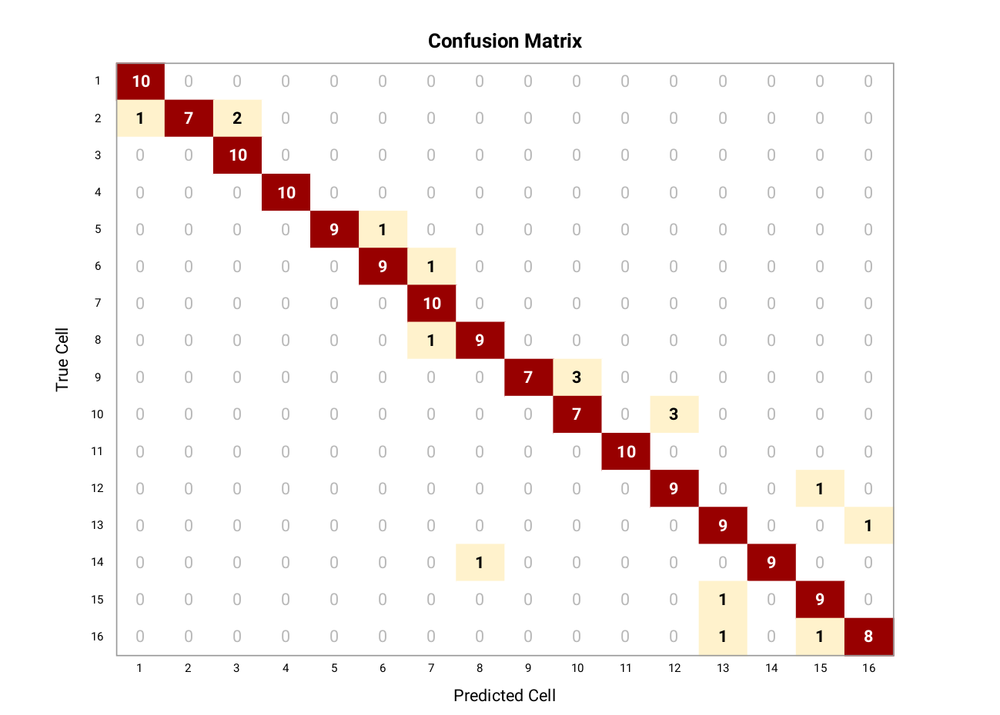

# Smartphone-Sensing

## Localization and Activity Recognition Apps

For the course, we had to develop applications for localization and activity recognition tasks, using KNNs, Bayesian filter and Particle filter.
All the apps were test on  `Xiaomi Redmi 5A (Android 7.1.2, API 25)`.

### Using KNN classifier

The application shows the user where they are among four different cells and also tells whether they are walking or standing still.

For activity recognition, we used accelerometer values, whereas for localization, the feature used is the number of times a Wi-Fi station is detected within a sample window. For each cell, we collected the samples and chose the Wi-Fi station that
appears the most and is the strongest in that cell. The k-value used is also 3 and Euclidean distance is again used for distance measurements.
When the application is running, the accelerometer sensor values are constantly checked as their values change, while the
Wi-Fi scan is only performed when a movement is detected, i.e. when the user is recognized as walking.

More information is provided in report 1.

### Using Bayesian Filters

We developed an android application that provides the location of the user within 16 cells on the fifth floor of the EWI building

We collected the RSSI information of the available access points in each of the 16 cells mapped in the provided floor
plan of the 5th floor of the EWI building. A total of 100 samples were collected for each cell, with a time interval of
300 ms between each Wi-Fi scan. We collected the data in two different scenarios, when the floor was empty and when it was crowded.

The collected data is then filtered out, all the access points besides eduroam or tudelft-dastud are removed, as these two can be considered permanent access points. We, then, split the collected samples for training (75%)
and testing purposes (25%).

We tested our application online for all the cells. Each cell is tested 10 times for 10 iterations. The confusion matrix is
shown in the figure.

### Novelty in Bayesian App
#### Bayesian Motion Model

In order to improve the accuracy of the Bayesian localization, we implemented a Bayesian motion model. For this, we
implemented a step and direction. 

1) Update frequency: The probability distribution of all the cells is updated every time a distance of 4 m is covered.
2) Motion model: The following is the conditional probability that we used to update the probability:

| Probability | Value |
| P (X i | X i ) | 0.1 |
| P (X i+1 | X i ) | 0.8 |
| P (X i+2 | X i ) | 0.1 |

*Probability Distribution for cells X i , X i+1 , X i+2*

